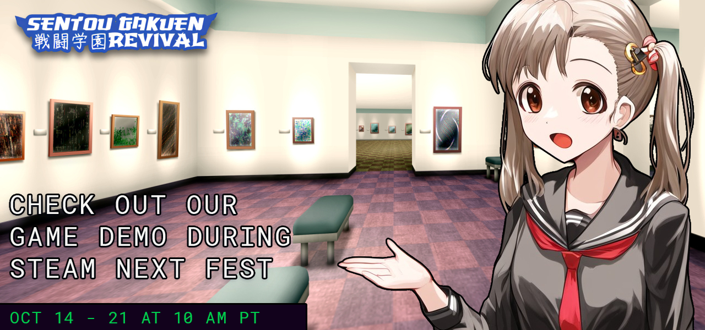

## Dear, students!
To celebrate the October 2024 edition of Steam Next Fest, we're excited to announce a special event where you can have your name eternalized at the city's museum! This is our way of showing our appreciation to the community, and it's super easy to participate.

### How to Join:
- Post a comment in [this thread](https://steamcommunity.com/app/405680/eventcomments/4847652627864583577) to let us know you're joining the event.
- (Optional) Set your Steam profile to public at the end of the fest.
That's it! Once you've posted here, all you need to do is spend some playtime in the Sentou Gakuen demo before Steam Next Fest ends.

<iframe src="https://store.steampowered.com/widget/3175150/" frameborder="0" width="100%" height="190"></iframe>

### How It Works:
- After the event ends, we'll be checking each participant's **total demo playtime** in Sentou Gakuen as shown on your Steam profile.
- The more hours you have accumulated in the demo, the higher up on the list your name will appear!
- If your Steam profile is set to private, you'll still be included, but you'll be placed lower on the list.
- The list of attendees will be featured in the city's museum during both the early access and the release version. The name that will be immortalized is your Steam display name.
- Our Disciplinary Committee has been given full rights and authorization to accept or reject applications for any reason.
The event will end along with Steam Next Fest on **October 21**, so be sure to rack up those hours in the demo before then to secure a high spot!

### Reward:
Your name here.

This is your chance to be part of the Sentou Gakuen legacy as it unfolds. Come and meet your fellow students—let's build this school together, one chaos-fueled day at a time.

### FAQ:

**Q: How do I secure a high rank on the list?**
Simply play the Sentou Gakuen demo as much as you can before Steam Next Fest ends. The more hours you have accumulated overall in the demo, the better your ranking!

**Q: How will my playtime be tracked?**
Once the event ends, our dedicated Student Council will be on the lookout, checking your total demo playtime on Steam through your profile. To ensure they can accurately tally your hours, make sure your profile is set to public during the data collection days!

**Q: Do I need to keep my Steam profile public during the entire event?**
No, you only need to set your profile to public when we pull the data on October 22-25. After that, feel free to switch it back to private!

**Q: What happens if my profile is private?**
We will still include your name, but you'll be placed lower on the list, regardless of your total playtime.

Thank you for being part of the Sentou Gakuen community! Let’s make this Next Fest unforgettable, and may your names forever be remembered in the halls of our city museum when the early access version arrives. 

Now you can proudly say, ***"I belong in the museum!"***

-Principal