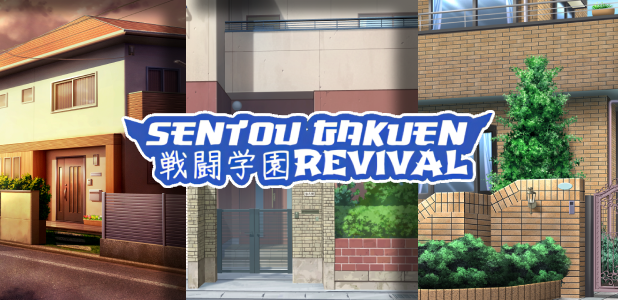

A student without a roof is like a test without answers—doomed to fail! Fortunately, that won’t be a problem anymore.

The long-awaited Housing System is now available! Players can own their own personal housing instance, providing a space for relaxation and customization. By default, other students can stumble into your house like uninvited drunk oyajis looking for free snacks, but you can toggle visibility off if you prefer solitude.

### What is Housing For?
Owning a house provides several benefits:
- **Increased Maximum Energy** – Housing offers a higher energy cap compared to a basic apartment.
- **Rest Feature** – Once every 20 hours, players can fully restore their energy by resting at home.
- **Student Visitation** – By default, other students can visit your home, but you can toggle visibility off at any time for privacy.
Higher-tier housing options come with additional benefits that increases maximum energy, giving players an advantage in their daily activities. Additionally, all houses come with their own upgrades, right now there are only two upgrades available, but more will come later.

In future updates, housing will be expandable, allowing players to add new rooms such as kitchens, living rooms, and more to personalize their space. Stay tuned for further improvements!

### How Do I Get a House?
Housing in Sentou Gakuen: Revival is obtained through Activity Tickets, which are earned via Steam item drops during gameplay. These tickets can be traded with other students, so if you’ve already secured your perfect home, worry not—they won’t go to waste. Currently, they’re used for housing exchanges, but more uses will be added in future updates! To upgrade your living space, head to the Staff Room and request better housing accommodations.

Next, to relocate to a different house, students must first obtain a Housing Permit issued by the Student Council. The council oversees the transfer process, ensuring that stashes, previous housing upgrades, and other personal belongings are safely moved to the new residence.

### Patches, Hotfixes, Small Updates:
Below are aggregated list of changes since last patch/hotfix post:
- Temporary Change: Students no longer need to upgrade their school entrance to receive Activity Ticket drops. For now, Steam drops will trigger automatically upon launching the game to maximize testing. This will be removed in a future update—so make the most of it while it lasts!
- Added 6 variants of Player Housing: Shirogane, Akebono, Amberstone, Aozora, Hinokawa, Yamabuki.
- Added new menu on Staff Room.
- Added new menu on Residential Area.
- Added Housing Permit on Student Council.
- Added Keybindings option on settings.
- Added dialogue text size option on settings.
- Updated Review Subject window to align horizontally instead of vertically.
- Reduced spawn rate of mythical creatures on exploration zone.
- Fixed Commendation Ticket not properly dropping.
- Fixed some achievements not properly triggered despite meeting requirements.
- Fixed main menu logo placed on wrong layers.
- Fixed main menu logo blocking players with low screen resolution from starting the game.
- Fixed bald preacher not dropping any loot, he now drops you glue. His head may be shiny, but at least his hands aren’t empty anymore.

### Patches, Hotfixes, Small Updates:
That said, please note a few things:
- Steam Inventory has its quirks. We’ve done our best to ensure it works, but unexpected issues may still arise. If something seems off, try restarting the game first—you’d be surprised how often that fixes things. Steam Inventory (along with Steam Workshop) remains one of the most painstakingly complex features to implement on Steam, yet its documentation is about as abundant as my will to debug it.
- This is just the first iteration of Player Housing, and we’re not done yet. Expect additions, removals, and changes as we refine the system based on feedback and future plans. Stay on your toes—your home might look different in the next update!

Remember, housing is a privilege, not a right—so don’t go turning it into a disaster zone!
-Principal